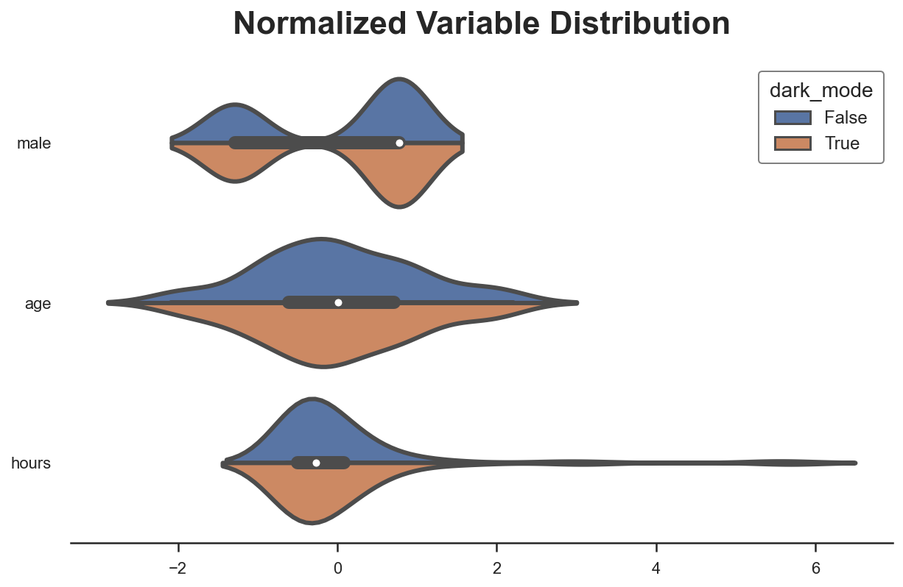

AB tests or randomized controlled trials are the **gold standard** in causal inference. By randomly exposing units to a treatment we make sure that individuals in both groups are comparable, on average, and any difference we observe can be attributed to the treatment effect alone.

However, often the treatment and control groups are **not perfectly comparable**. This could be due to the fact that randomization was not perfect or available. Not always we can randomize a treatment, for ethical or practical reasons. And even when we can, sometimes we do not have enough individuals or units so that differences between groups are seizable. This happens often, for example, when randomization is not done at the individual level, but at a higher level of aggregation, for example zipcodes, counties or even states.

In these settings, we can still recover a causal estimate of the treatment effect if we have **enough information** about individuals, by making the treatment and control group comparable, ex-post. In this blog post, we are going to introduce and compare different procedures to estimate causal effects in presence of imbalances between treatment and control groups that are **fully observable**. In particular we are going to analyze weighting, matching and regression procedures.

## Example

Assume we had blog on statistics and causal inference 😇. To improve user experience, we are considering **releasing a dark mode**, and we would like to understand whether this new feature increases the time users spend on our blog. 


We are not a sophisticated company, therefore we do not run an AB test but we simply release the dark mode and we observe whether users select it or not and the time they spend on the blog. We know that there might be **selection**:  users that prefer the dark mode could have different reading preferences and this might complicate our causal analysis.

We can represent the data generating process with the following [**Directed Acyclic Graph (DAG)**](https://towardsdatascience.com/b63dc69e3d8c).


We generate the simulated data using the data generating process `dgp_darkmode()` from [`src.dgp`](https://github.com/matteocourthoud/Blog-Posts/blob/main/notebooks/src/dgp.py). I also import some plotting functions and libraries from [`src.utils`](https://github.com/matteocourthoud/Blog-Posts/blob/main/notebooks/src/utils.py).


```python
%matplotlib inline
%config InlineBackend.figure_format = 'retina'
```


```python
from src.utils import *
from src.dgp import dgp_darkmode
```


```python
df = dgp_darkmode().generate_data()
df.head()
```


<div>
<style scoped>
    .dataframe tbody tr th:only-of-type {
        vertical-align: middle;
    }

    .dataframe tbody tr th {
        vertical-align: top;
    }

    .dataframe thead th {
        text-align: right;
    }
</style>
<table border="1" class="dataframe">
  <thead>
    <tr style="text-align: right;">
      <th></th>
      <th>read_time</th>
      <th>dark_mode</th>
      <th>male</th>
      <th>age</th>
      <th>hours</th>
    </tr>
  </thead>
  <tbody>
    <tr>
      <th>0</th>
      <td>14.4</td>
      <td>False</td>
      <td>0</td>
      <td>43.0</td>
      <td>65.6</td>
    </tr>
    <tr>
      <th>1</th>
      <td>15.4</td>
      <td>False</td>
      <td>1</td>
      <td>55.0</td>
      <td>125.4</td>
    </tr>
    <tr>
      <th>2</th>
      <td>20.9</td>
      <td>True</td>
      <td>0</td>
      <td>23.0</td>
      <td>642.6</td>
    </tr>
    <tr>
      <th>3</th>
      <td>20.0</td>
      <td>False</td>
      <td>0</td>
      <td>41.0</td>
      <td>129.1</td>
    </tr>
    <tr>
      <th>4</th>
      <td>21.5</td>
      <td>True</td>
      <td>0</td>
      <td>29.0</td>
      <td>190.2</td>
    </tr>
  </tbody>
</table>
</div>


We have informations on 300 users for whom we observe whether they select the `dark_mode` (the treatment), their weekly `read_time` (the outcome of interest) and some characteristics like `gender`, `age` and total `hours` previously spend on the blog.

We would like to estimate the effect of the new `dark_mode` on users' `read_time`. If we were runnig an [**AB test**](https://de.wikipedia.org/wiki/A/B-Test) or randomized control trial, we could just compare users with and without the dark mode and we could attribute the difference in average reading time to the `dark_mode`. Let's check what number we would get.


```python
np.mean(df.loc[df.dark_mode==True, 'read_time']) - np.mean(df.loc[df.dark_mode==False, 'read_time'])
```


    -0.4446330948042103


Individuals that select the `dark_mode` spend on average 1.37 hours less on the blog, per week. Should we conclude that `dark_mode` is a **bad idea**? Is this a causal effect?

We did not randomize the `dark_mode` so that users that selected it might not be directly **comparable** with users that didn't. Can we verify this concern? Partially. We can only check characteristics that we observe, `gender`, `age` and total `hours` in our setting. We cannot check if users differ along other dimensions that we don't observe.

Let's use the `create_table_one` function from Uber's [`causalml`](https://causalml.readthedocs.io/) package to produce a **covariate balance table**, containing the average value of our observable characteristics, across treatment and control groups. As the name suggests, this should always be the first table you present in causal inference analysis.


```python
from causalml.match import create_table_one

X = ['male', 'age', 'hours']
table1 = create_table_one(df, 'dark_mode', X)
table1
```


<div>
<style scoped>
    .dataframe tbody tr th:only-of-type {
        vertical-align: middle;
    }

    .dataframe tbody tr th {
        vertical-align: top;
    }

    .dataframe thead th {
        text-align: right;
    }
</style>
<table border="1" class="dataframe">
  <thead>
    <tr style="text-align: right;">
      <th></th>
      <th>Control</th>
      <th>Treatment</th>
      <th>SMD</th>
    </tr>
    <tr>
      <th>Variable</th>
      <th></th>
      <th></th>
      <th></th>
    </tr>
  </thead>
  <tbody>
    <tr>
      <th>n</th>
      <td>151</td>
      <td>149</td>
      <td></td>
    </tr>
    <tr>
      <th>age</th>
      <td>46.01 (9.79)</td>
      <td>39.09 (11.53)</td>
      <td>-0.6469</td>
    </tr>
    <tr>
      <th>hours</th>
      <td>337.78 (464.00)</td>
      <td>328.57 (442.12)</td>
      <td>-0.0203</td>
    </tr>
    <tr>
      <th>male</th>
      <td>0.34 (0.47)</td>
      <td>0.66 (0.48)</td>
      <td>0.6732</td>
    </tr>
  </tbody>
</table>
</div>


There seems to be **some difference** between treatment (`dark_mode`) and control group. In particular, users that select the `dark_mode` are older, have spent less hours on the blog and they are more likely to be males.

Another way to visually observe all the differences at once is with a **paired violinplot**. The advantage of the paired violinplot is that it allows us to observe the full distribution of the variable (approximated via [kernel density estimation](https://en.wikipedia.org/wiki/Kernel_density_estimation)).


```python
def plot_distributions(df, X, d):
    df_long = df.copy()[X + [d]]
    df_long[X] =(df_long[X] - df_long[X].mean()) / df_long[X].std()
    df_long = pd.melt(df_long, id_vars=d, value_name='value')
    sns.violinplot(y="variable", x="value", hue=d, data=df_long, split=True).\
        set(xlabel="", ylabel="", title="Normalized Variable Distribution");
```


```python
plot_distributions(df, X, "dark_mode")
```


    

    


The insight of the violinplot is very similar: it seems that users that select the `dark_mode` are different from users that don't.

**Why do we care?**

If we do not control for the observable characteristics, we are unable to estimate the true treatment effect. In short, we cannot be certain that the difference in outcome, `read_time`, can be attributed to the treatment, `dark_mode`, instead of other characteristics. For example, it could be that males read less and also prefer the `dark_mode`, therefore we observe a negative correlation even though `dark_mode` has no effect on `read_time` (or even positive).

In terms of Dyrected Acyclic Graphs, this means that we have several [**backdoor paths**](https://towardsdatascience.com/b63dc69e3d8c) that we need to **block** in order for our analysis to be **causal**. 


How do we **block backdoor paths**? By conditioning the analysis on those intermediate variables. The conditional analysis allows us to recover the average treatment effect of the `dark_mode` on `read_time`.


How do we **condition the analysis** on `gender`, `age` and `hours`? We have some options:

- **Matching**
- **Propensity score** weighting
- **Regression** with control variables

Let's explore and compare them!

## Conditional Analysis

We assume that for a set of subjects $i = 1, ..., n$ we observed a tuple $(D_i, Y_i, X_i)$ comprised of 


- a treatment assignment $D_i \in \lbrace 0, 1 \rbrace$ (`dark_mode`)
- a response $Y_i \in \mathbb R$ (`read_time`)
- a feature vector $X_i \in \mathbb R^n$ (`gender`, `age` and `hours`)

**Assumption 1 : unconfoundedness** (or ignorability, or selection on observables)

$$
\big \lbrace Y_i^{(1)} , Y_i^{(0)} \big \rbrace \ \perp \ D_i \ | \ X_i
$$

i.e. conditional on observable characteristics $X$, the treatment assignment $D$ is as good as random. What we are effectively assuming is that there is no other characteristics that we do not observe that could impact both whether a user selects the `dark_mode` and their `read_time`. This is a **strong assumption** that is more likely to be satisfied the more individual characteristics we observe.

**Assumption 2: overlap** (or common support)

$$
\exists \eta > 0 \ : \ \eta \leq \mathbb E \left[ T_i = 1 \ \big | \ X_i = x \right] \leq 1-\eta
$$

i.e. no observation is deterministically assigned to the treatment or control group. This is a more technical assumption that basically means that for any level of `gender`, `age` or `hours`, there could exist an individual that select the `dark_mode` and one that doesn't. Differently from the unconfoundedness assumption, the overal assumption is **testable**.

### Matching

The first and most intuitive method to perform conditional analysis is **matching**. 

The **idea** of matching is very simple. Since we are not sure whether, for example, male and female users are directly comparable, we do the analysis within gender. Instead of comparing `read_time` across `dark_mode` in the whole sample, we do it separately for male and female users.


```python
df_gender = pd.pivot_table(df, values='read_time', index='male', columns='dark_mode', aggfunc=np.mean)
df_gender['diff'] = df_gender[1] - df_gender[0] 
df_gender
```


<div>
<style scoped>
    .dataframe tbody tr th:only-of-type {
        vertical-align: middle;
    }

    .dataframe tbody tr th {
        vertical-align: top;
    }

    .dataframe thead th {
        text-align: right;
    }
</style>
<table border="1" class="dataframe">
  <thead>
    <tr style="text-align: right;">
      <th>dark_mode</th>
      <th>False</th>
      <th>True</th>
      <th>diff</th>
    </tr>
    <tr>
      <th>male</th>
      <th></th>
      <th></th>
      <th></th>
    </tr>
  </thead>
  <tbody>
    <tr>
      <th>0</th>
      <td>20.318000</td>
      <td>22.24902</td>
      <td>1.931020</td>
    </tr>
    <tr>
      <th>1</th>
      <td>16.933333</td>
      <td>16.89898</td>
      <td>-0.034354</td>
    </tr>
  </tbody>
</table>
</div>


Now the effect of `dark_mode` seems reversed: it is negative for male users (-0.79) but bigger and positive for female users (+1.38), suggesting a positive aggregate effect, 1.38 - 0.79 = 0.59 (assuming equal proportion of genders)! This sign reversal is a very classical example of the [Simpson's Paradox](https://en.wikipedia.org/wiki/Simpson%27s_paradox).

This comparison was easy to perform for `gender`, since it is a binary variable. With multiple variables, potentially continuous, matching becomes much more difficult. One common strategy is to **match users** in the treatment group with the most similar user in the control group, using some sort of [nearest neighbor algorithm](https://en.wikipedia.org/wiki/Nearest_neighbour_algorithm). I won't go into the algorithm details here, but we can perform the matching with the `NearestNeighborMatch` function from the `causalml` package. 

The `NearestNeighborMatch` function generates a new dataset where users in the treatment group have been matched 1:1 (option `ratio=1`) to users in the control group.


```python
from causalml.match import NearestNeighborMatch

psm = NearestNeighborMatch(replace=True, ratio=1, random_state=1)
df_matched = psm.match(data=df, treatment_col="dark_mode", score_cols=X)
```

Are the two groups more comparable now? We can produce a new version of the **balance table**.


```python
table1_matched = create_table_one(df_matched, "dark_mode", X)
table1_matched
```


<div>
<style scoped>
    .dataframe tbody tr th:only-of-type {
        vertical-align: middle;
    }

    .dataframe tbody tr th {
        vertical-align: top;
    }

    .dataframe thead th {
        text-align: right;
    }
</style>
<table border="1" class="dataframe">
  <thead>
    <tr style="text-align: right;">
      <th></th>
      <th>Control</th>
      <th>Treatment</th>
      <th>SMD</th>
    </tr>
    <tr>
      <th>Variable</th>
      <th></th>
      <th></th>
      <th></th>
    </tr>
  </thead>
  <tbody>
    <tr>
      <th>n</th>
      <td>104</td>
      <td>104</td>
      <td></td>
    </tr>
    <tr>
      <th>age</th>
      <td>41.93 (10.05)</td>
      <td>41.85 (10.02)</td>
      <td>-0.0086</td>
    </tr>
    <tr>
      <th>hours</th>
      <td>206.92 (309.62)</td>
      <td>209.48 (321.79)</td>
      <td>0.0081</td>
    </tr>
    <tr>
      <th>male</th>
      <td>0.62 (0.49)</td>
      <td>0.62 (0.49)</td>
      <td>0.0</td>
    </tr>
  </tbody>
</table>
</div>


Now the average differences between the two groups have **shrunk** by at least a couple of orders of magnitude. However, note how the sample size has slightly decreased (300 $\to$ 246) since (1) we only match treated users and (2) we are not able to find a good match for all of them.

We can visually inspect distributional differences with the paired violinplot.


```python
plot_distributions(df_matched, X, "dark_mode")
```


    

    


A popular way to visualize pre- and post-matching covariate balance is the **balance plot** that essentially displays the standardized mean differences before and after matching, for each control variable.


```python
def plot_balance(t1, t2, X):
    df_smd = pd.DataFrame({"Variable": X + X,
                           "Sample": ["Unadjusted" for _ in range(len(X))] + ["Adjusted" for _ in range(len(X))],
                           "Standardized Mean Difference": t1["SMD"][1:].to_list() + 
                                                           t2["SMD"][1:].to_list()})

    sns.scatterplot(x="Standardized Mean Difference", y="Variable", hue="Sample", data=df_smd).\
        set(title="Balance Plot")
    plt.axvline(x=0, color='k', ls='--', zorder=-1, alpha=0.3);
```


```python
plot_balance(table1, table1_matched, X)
```


    

    


As we can see, now all differences in observable characteristics between the two groups are essentially zero. We could also compare the distributions using other metrics or test statistics, such as the [Kolmogorov-Smirnov test statistic](https://towardsdatascience.com/9b06ee4d30bf).

How do we **estimate the average treatment effect**? We can simply do a difference in means. An equivalent way that automatically provides standard errors is to run a linear regression of the outcome, `read_time`, on the treatment, `dark_mode`. 

**Note** that, since we have performed the matching for each treated user, the treatment effect we are estimating is the **average treatment effect on the treated (ATT)**, which can be different from the average treatment effect if the treated sample differs from the overall population (which is likely to be the case, since we are doing matching in the first place).


```python
smf.ols("read_time ~ dark_mode", data=df_matched).fit().summary().tables[1]
```


<table class="simpletable">
<tr>
          <td></td>             <th>coef</th>     <th>std err</th>      <th>t</th>      <th>P>|t|</th>  <th>[0.025</th>    <th>0.975]</th>  
</tr>
<tr>
  <th>Intercept</th>         <td>   17.0365</td> <td>    0.469</td> <td>   36.363</td> <td> 0.000</td> <td>   16.113</td> <td>   17.960</td>
</tr>
<tr>
  <th>dark_mode[T.True]</th> <td>    1.4490</td> <td>    0.663</td> <td>    2.187</td> <td> 0.030</td> <td>    0.143</td> <td>    2.755</td>
</tr>
</table>


The effect is now positive, but not statistically significant.

**Note** that we might have matched multiple treated users with the same untreated user, violating the independence assumption across observations and, in turn, distorting inference. 

We have two solutions:

1. cluster standard errors at the matched individual level 
2. compute standard errors via bootstrap

We implement the first and cluster the standard errors by the original individual identifiers (the dataframe index).


```python
smf.ols("read_time ~ dark_mode", data=df_matched)\
    .fit(cov_type='cluster', cov_kwds={'groups': df_matched.index})\
    .summary().tables[1]
```


<table class="simpletable">
<tr>
          <td></td>             <th>coef</th>     <th>std err</th>      <th>z</th>      <th>P>|z|</th>  <th>[0.025</th>    <th>0.975]</th>  
</tr>
<tr>
  <th>Intercept</th>         <td>   17.0365</td> <td>    0.650</td> <td>   26.217</td> <td> 0.000</td> <td>   15.763</td> <td>   18.310</td>
</tr>
<tr>
  <th>dark_mode[T.True]</th> <td>    1.4490</td> <td>    0.821</td> <td>    1.765</td> <td> 0.078</td> <td>   -0.160</td> <td>    3.058</td>
</tr>
</table>


The effect is even less statistically significant.

### Propensity Score

[Rosenbaum and Rubin (1983)](https://academic.oup.com/biomet/article/70/1/41/240879) proved a very powerful result: if the **strong ignorability assumption** holds, it is sufficient to condition the analysis on the probability ot treatment, the **propensity score**, in order to have conditional independence.

$$
\big \lbrace Y_i^{(1)} , Y_i^{(0)} \big \rbrace \ \perp \ D_i \ | \ X_i \quad \leftrightarrow \quad \big \lbrace Y_i^{(1)} , Y_i^{(0)} \big \rbrace \ \perp \ D_i \ | \ e(X_i)
$$

Where $e(X_i)$ is the probability of treatment of individual $i$, given the observable characteristics $X_i$. 

$$
e(x) = \Pr \left( D_i = 1 \ \big | \ X_i = x \right)
$$

**Note** that in an AB test the propensity score is constant across individuals.

The result from Rosenbaum and Rubin (1983) is incredibly **powerful and practical**, since the propensity score is a **one dimensional** variable, while $X$ might be very high dimensional. 

Under the **unconfoundedness** assumption introduced above, we can rewrite the average treatment effect as

$$
\tau(x) = \mathbb E \left[ Y^{(1)} - Y^{(0)} \ \big| \ X = x \right] = \mathbb E \left[ \frac{D_i Y_i}{e(X_i)} - \frac{(1-D_i) Y_i}{1-e(X_i)} \right]
$$

Note that this formulation of the average treatment effect does not depend on the potential outcomes $Y_i^{(1)}$ and $Y_i^{(0)}$, but only on the observed outcomes $Y_i$.

This formulation of the average treatment effect implies the **Inverse Propensity Weighted (IPW)** estimator which is an unbiased estimator for the average treatment effect $\tau$.

$$
\hat \tau^{IPW} = \frac{1}{n} \sum _ {i=1}^{n} \left( \frac{D_i Y_i}{e(X_i)} - \frac{(1-D_i) Y_i}{1-e(X_i)} \right)
$$

This estimator is **unfeasible** since we do not observe the propensity scores $e(X_i)$. However, we can estimate them. Actually, [Imbens, Hirano, Ridder (2003)](https://onlinelibrary.wiley.com/doi/abs/10.1111/1468-0262.00442) show that you **should** use the estimated propensity scores even if you knew the true values (for example because you know the sampling procedure). The idea is that if the estimated propensity scores are different from the true ones, this can be informative in the estimation.

There are several possible ways to estimate a probability, the simplest and most common one being [**logistic regression**](https://en.wikipedia.org/wiki/Logistic_regression).


```python
from sklearn.linear_model import LogisticRegressionCV

df["pscore"] = LogisticRegressionCV().fit(y=df["dark_mode"], X=df[X]).predict_proba(df[X])[:,1]
```

It is best practice, whenever we fit a prediction model, to **fit the model on a different sample** with respect to the one that we use for inference. This practice is usually called **cross-validation** or cross-fitting. One of the best (but computationally expensive) cross-validation procedures is **leave-one-out (LOO)** cross-fitting: when predicting the value of observation $i$ we use all observations except for $i$. We implement the LOO cross-fitting procedure using the `cross_val_predict` and `LeaveOneOut` functions from the [`sklearn`](https://scikit-learn.org/) package.


```python
from sklearn.model_selection import cross_val_predict, LeaveOneOut

df['pscore'] = cross_val_predict(estimator=LogisticRegressionCV(), 
                                 X=df[X], 
                                 y=df["dark_mode"],
                                 cv=LeaveOneOut(),
                                 method='predict_proba',
                                 n_jobs=-1)[:,1]
```

An **important check** to perform after estimating propensity scores is plotting them, across the treatment and control groups. First of all, we can then observe whether the two groups are balanced or not, depending on how close the two distributions are. Moreover, we can also check how likely it is that the **overlap assumption** is satisfied. Ideally both distributions should span the same interval.


```python
sns.histplot(data=df, x='pscore', hue='dark_mode', bins=30, stat='density', common_norm=False).\
    set(ylabel="", title="Distribution of Propensity Scores");
```


    

    


As expected, the distribution of propensity scores between the treatment and control group is **significantly different**, suggesting that the two groups are hardly comparable. However, there is significant overlap in the support of the distributions, suggesting that the overlap assumption is likely to be satisfied.

How do we estimate the average treatment effect?

Once we have computed the propensity scores, we just need to re-weight observations by their respective propensity score. We can then either compute a difference between the weighted `read_time` averages, or run a weighted regression of `read_time` on `dark_mode`.


```python
w = 1 / (df["pscore"] * df["dark_mode"] + (1-df["pscore"]) * (1-df["dark_mode"]))
smf.wls("read_time ~ dark_mode", weights=w, data=df).fit().summary().tables[1]
```


<table class="simpletable">
<tr>
          <td></td>             <th>coef</th>     <th>std err</th>      <th>t</th>      <th>P>|t|</th>  <th>[0.025</th>    <th>0.975]</th>  
</tr>
<tr>
  <th>Intercept</th>         <td>   18.5859</td> <td>    0.412</td> <td>   45.110</td> <td> 0.000</td> <td>   17.775</td> <td>   19.397</td>
</tr>
<tr>
  <th>dark_mode[T.True]</th> <td>    1.1303</td> <td>    0.582</td> <td>    1.942</td> <td> 0.053</td> <td>   -0.015</td> <td>    2.276</td>
</tr>
</table>


The effect of the `dark_mode` is now positive and almost statistically significant, at the 5% level.

**Note** that the `wls` function automatically normalizes weights so that they sum to 1, which greatly improves the stability of the estimator. In fact, the unnormalized IPW estimator can be very **unstable** when the propensity scores approach zero or one.

Also **note** that the standard errors are not correct, since they do not take into account the extra uncertainty introduced in the estimation of the propensity score. This issue was noted by [Abadie and Imbens (2016)](https://onlinelibrary.wiley.com/doi/abs/10.3982/ECTA11293).

### Regression with Control Variables

The last method we are going to review today is **linear regression with control variables**. This estimator is extremely easy to implement, since we just need to add the user characteristics - `gender`, `age` and `hours` - to the regression of `read_time` on `dark_mode`.


```python
smf.ols("read_time ~ dark_mode + male + age + hours", data=df).fit().summary().tables[1]
```


<table class="simpletable">
<tr>
          <td></td>             <th>coef</th>     <th>std err</th>      <th>t</th>      <th>P>|t|</th>  <th>[0.025</th>    <th>0.975]</th>  
</tr>
<tr>
  <th>Intercept</th>         <td>   16.8591</td> <td>    1.082</td> <td>   15.577</td> <td> 0.000</td> <td>   14.729</td> <td>   18.989</td>
</tr>
<tr>
  <th>dark_mode[T.True]</th> <td>    1.3858</td> <td>    0.524</td> <td>    2.646</td> <td> 0.009</td> <td>    0.355</td> <td>    2.417</td>
</tr>
<tr>
  <th>male</th>              <td>   -4.4855</td> <td>    0.499</td> <td>   -8.990</td> <td> 0.000</td> <td>   -5.468</td> <td>   -3.504</td>
</tr>
<tr>
  <th>age</th>               <td>    0.0513</td> <td>    0.022</td> <td>    2.311</td> <td> 0.022</td> <td>    0.008</td> <td>    0.095</td>
</tr>
<tr>
  <th>hours</th>             <td>    0.0043</td> <td>    0.001</td> <td>    8.427</td> <td> 0.000</td> <td>    0.003</td> <td>    0.005</td>
</tr>
</table>


The average treatment effect is again positive and statistically significant at the 1% level!

## Comparison

How do the different methods compare to each other?

### IPW and Regression

There is a **tight connection** between the IPW estimator and linear regression with covariates. This is particularly evident when we have a one-dimensional, discrete covariate $X$.

In this case, the estimand of IPW (i.e. the quantity that IPW estimates) is given by

$$
\tau^{IPW} = \frac{ \sum_x \color{red}{\tau_x} \color{blue}{\Pr(D_i | X_i = x)} \Pr(X_i = x)}{\sum_x \color{blue}{\Pr(D_i | X_i = x)} \Pr(X_i = x)}
$$

The IPW estimand is a weighted average of the treatment effects $\tau_x$, where the weights are given by the **treatment probabilities**.

On the other hand, the estimand of linear regression with control variables is

$$
\tau^{OLS} = \frac{ \sum_x \color{red}{\tau_x} \color{blue}{\Pr(D_i | X_i = x)(1 - \Pr(D_i | X_i = x)) } \Pr(X_i = x)}{\sum_x \color{blue}{\Pr(D_i | X_i = x)(1 - \Pr(D_i | X_i = x)) } \Pr(X_i = x)}
$$

The OLS estimand is a weighted average of the treatment effects $\tau_x$, where the weights are given by the **variances of the treatment probabilities**. This means that linear regression is a weighted estimator, that gives more weight to observations that have characteristics for which we observe more treatment variability. Since a binary random variable has the highest variance when its expected value is 0.5, **OLS gives the most weight to observations that have characteristics for which we observe a 50/50 split between treatment and control group**. On the other hand, if for some characteristics we only observe treated or untreated individuals, those observations are going to receive zero weight. I recommend Chapter 3 of [Angrist and Pischke (2009)](https://www.mostlyharmlesseconometrics.com/) for more details.

### IPW and Matching

As we have seen in the IPW section, [Rosenbaum and Rubin (1983)](https://academic.oup.com/biomet/article/70/1/41/240879) result tells us that we do not need to perform the analysis conditional on all the covariates $X$, but it is sufficient to condition on the propensity score $e(X)$.

We have seed how this result implies a weighted estimator but it also extends to matching: we do not need to match observations on all the covariates $X$, but it is sufficient to **match them on the propensity score** $e(X)$. This method is called propensity score matching.


```python
psm = NearestNeighborMatch(replace=False, random_state=1)
df_ipwmatched = psm.match(data=df, treatment_col="dark_mode", score_cols=['pscore'])
```

As before, after matching, we can simply compute the estimate as a difference in means, remembering that observations are **not independent** and therefore we need to be cautious when doing inference.


```python
smf.ols("read_time ~ dark_mode", data=df_ipwmatched)\
    .fit(cov_type='cluster', cov_kwds={'groups': df_ipwmatched.index})\
    .summary().tables[1]
```


<table class="simpletable">
<tr>
          <td></td>             <th>coef</th>     <th>std err</th>      <th>z</th>      <th>P>|z|</th>  <th>[0.025</th>    <th>0.975]</th>  
</tr>
<tr>
  <th>Intercept</th>         <td>   18.4633</td> <td>    0.505</td> <td>   36.576</td> <td> 0.000</td> <td>   17.474</td> <td>   19.453</td>
</tr>
<tr>
  <th>dark_mode[T.True]</th> <td>    1.1888</td> <td>    0.703</td> <td>    1.692</td> <td> 0.091</td> <td>   -0.188</td> <td>    2.566</td>
</tr>
</table>


The estimated effect of `dark_mode` is positive, significant at the 1% level and very close to the true value of 2!

## Conclusion

In this blog post, we have seen how to perform **conditional analysis** using different approached. Matching directly matches most similar units in the treatment and control group. Weighting simply assigns different weight to different observations depending on their probability of receiving the treatment. Regression instead weights observations depending on the conditional treatment variances, giving more weight to observations that have characteristics common to both the treatment and control group.

These procedures are **extremely helpful** because they can either allow us to estimate causal effects from (very rich) observational data or correct experimental estimates when randomization was not perfect or we have a small sample.

Last but not least, if you want to know more, I strongly recommend this **video lecture** on propensity scores from [Paul Goldsmith-Pinkham](https://paulgp.github.io/) that is freely available online.

<br>



<br>

The whole course is a **gem** and it is an incredible privilege to have such high quality material available online for free!

### References

[1] P. Rosenbaum, D. Rubin, [The central role of the propensity score in observational studies for causal effects](https://academic.oup.com/biomet/article/70/1/41/240879) (1983), *Biometrika*.

[2] G. Imbens, K. Hirano, G. Ridder, [Efficient Estimation of Average Treatment Effects Using the Estimated Propensity Score](https://onlinelibrary.wiley.com/doi/abs/10.1111/1468-0262.00442) (2003), *Econometrica*.

[3] J. Angrist, J. S. Pischke, [Mostly harmless econometrics: An Empiricist's Companion](https://www.mostlyharmlesseconometrics.com/) (2009), *Princeton University Press*.

### Related Articles

- [Understanding The Frisch-Waugh-Lovell Theorem](https://towardsdatascience.com/59f801eb3299)
- [How to Compare Two or More Distributions](https://towardsdatascience.com/9b06ee4d30bf)
- [DAGs and Control Variables](https://towardsdatascience.com/b63dc69e3d8c)

### Code

You can find the original Jupyter Notebook here:

https://github.com/matteocourthoud/Blog-Posts/blob/main/notebooks/ipw.ipynb
